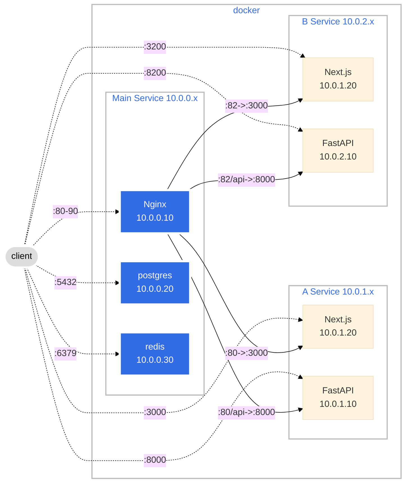

### docker compose
- Nginx, PostgreSQL, Redis, A service (FastAPI, Next.js), B service ((FastAPI, Next.js)

```mermaid
%%{init: {'theme':'base'}}%%
graph LR;
  client([client])-.->|:80-90|nginx;
  client-.->|:5432|postgres;
  client-.->|:6379|redis;
  client-.->|:3000|service-a-front;
  client-.->|:8000|service-a-back;
  client-.->|:3200|service-b-front;
  client-.->|:8200|service-b-back;
  nginx-->|:80->:3000|service-a-front;
  nginx-->|:80/api->:8000|service-a-back;
  nginx-->|:82->:3000|service-b-front;
  nginx-->|:82/api->:8000|service-b-back;
  subgraph docker
    subgraph dev[<center>Main Service 10.0.0.x</center>]
    nginx[Nginx<br/>10.0.0.10];
    postgres[postgres<br/>10.0.0.20];
    redis[redis<br/>10.0.0.30];    
    end
    subgraph service-a[<center>A Service 10.0.1.x</center>]
    service-a-back[FastAPI<br/>10.0.1.10];
    service-a-front[Next.js<br/>10.0.1.20];
    end
    subgraph service-b[<center>B Service 10.0.2.x</center>]
    service-b-back[FastAPI<br/>10.0.2.10];
    service-b-front[Next.js<br/>10.0.1.20];    
    end    
  end
  classDef plain fill:#ddd,stroke:#fff,stroke-width:4px,color:#000;
  classDef server fill:#326ce5,stroke:#fff,stroke-width:4px,color:#fff;
  classDef cluster fill:#fff,stroke:#bbb,stroke-width:2px,color:#326ce5;
  class nginx,postgres,redis server;
  class client plain;
  class service-a,service-b,storybook cluster;
```
